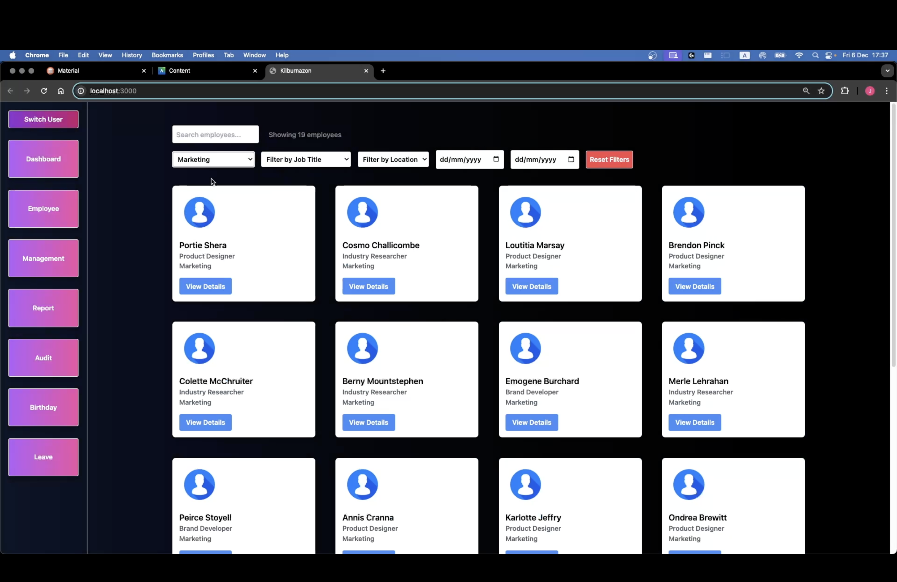
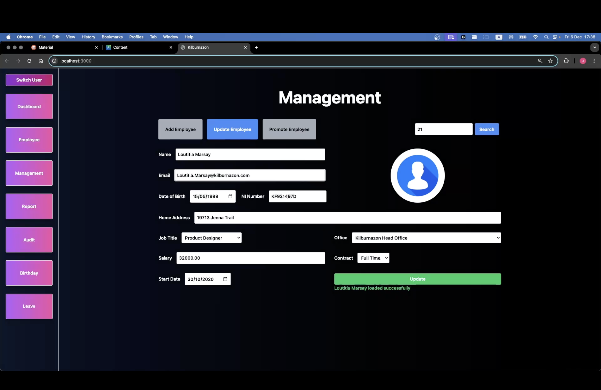
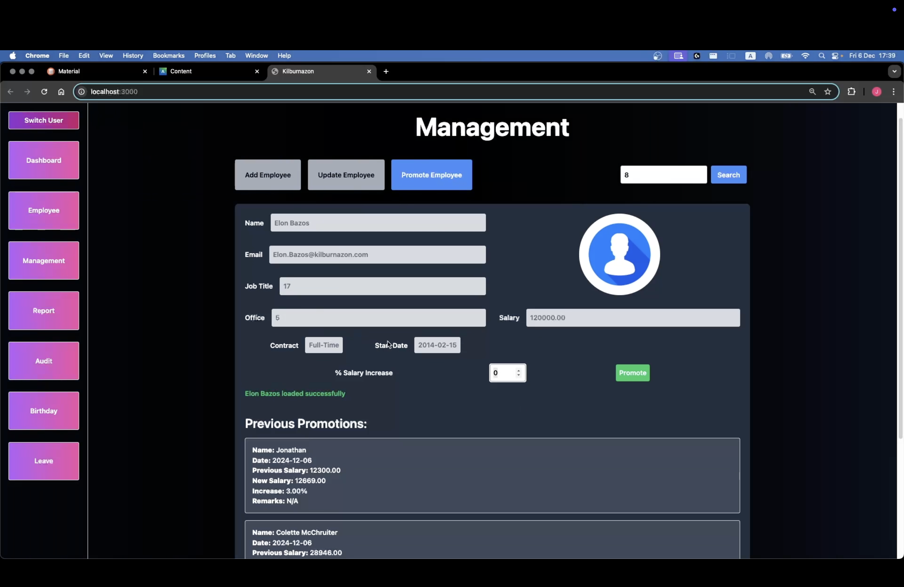
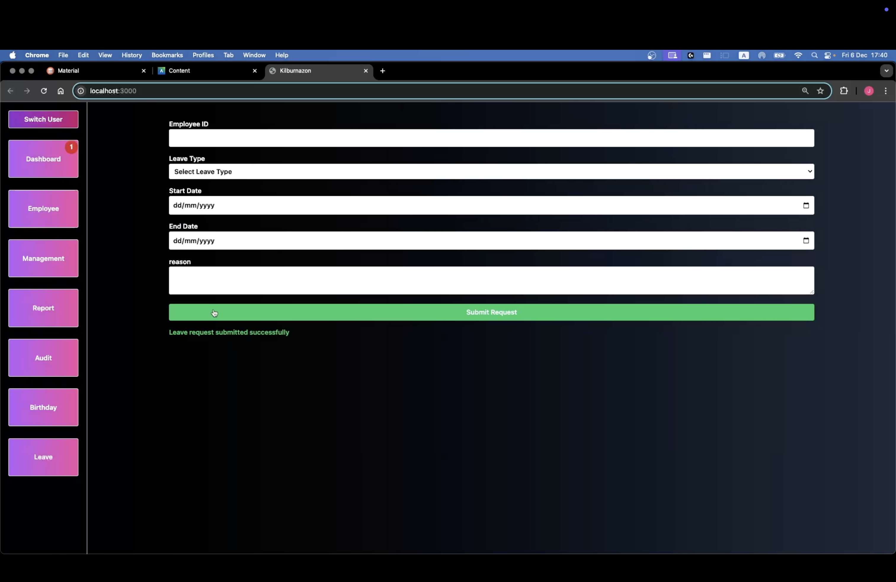
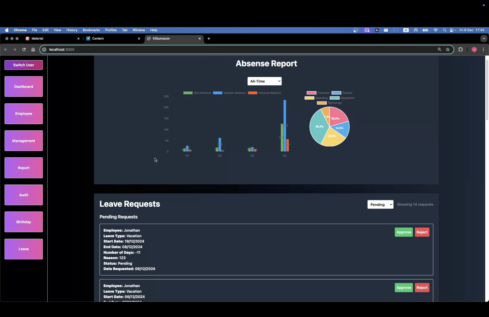
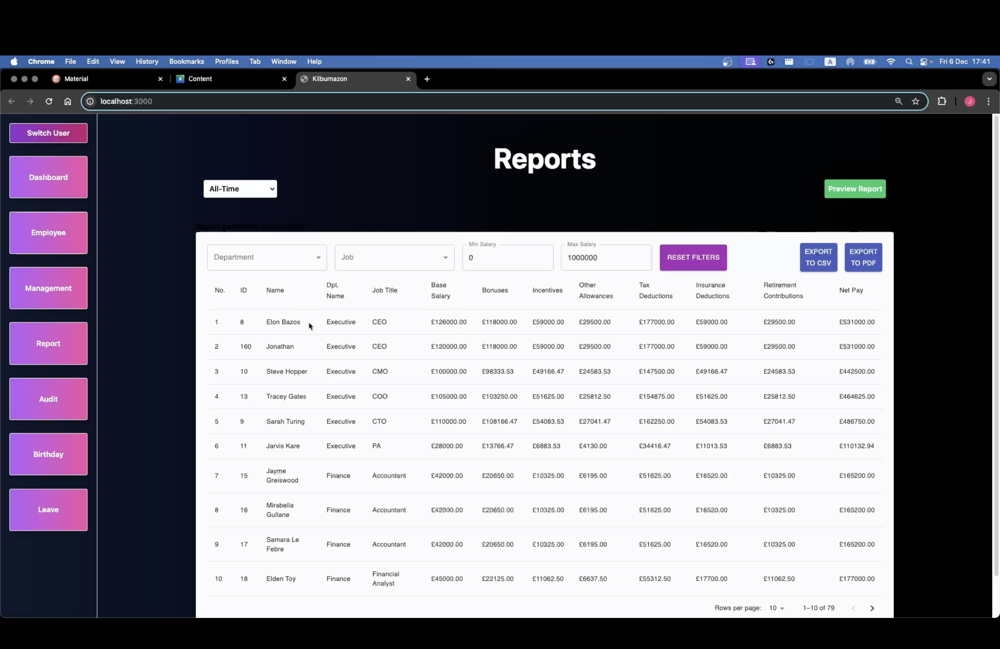
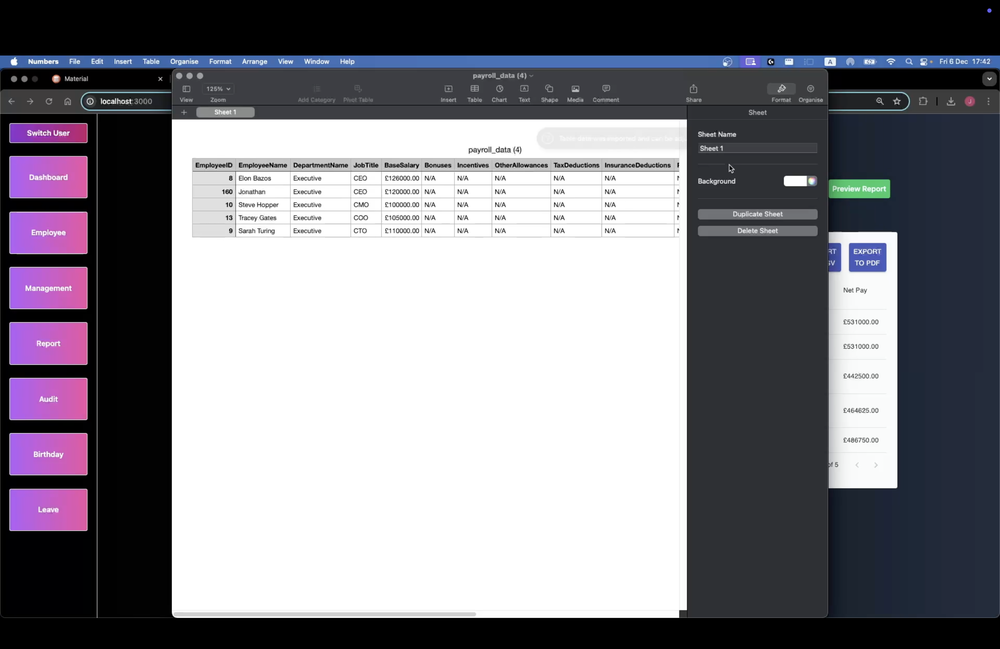
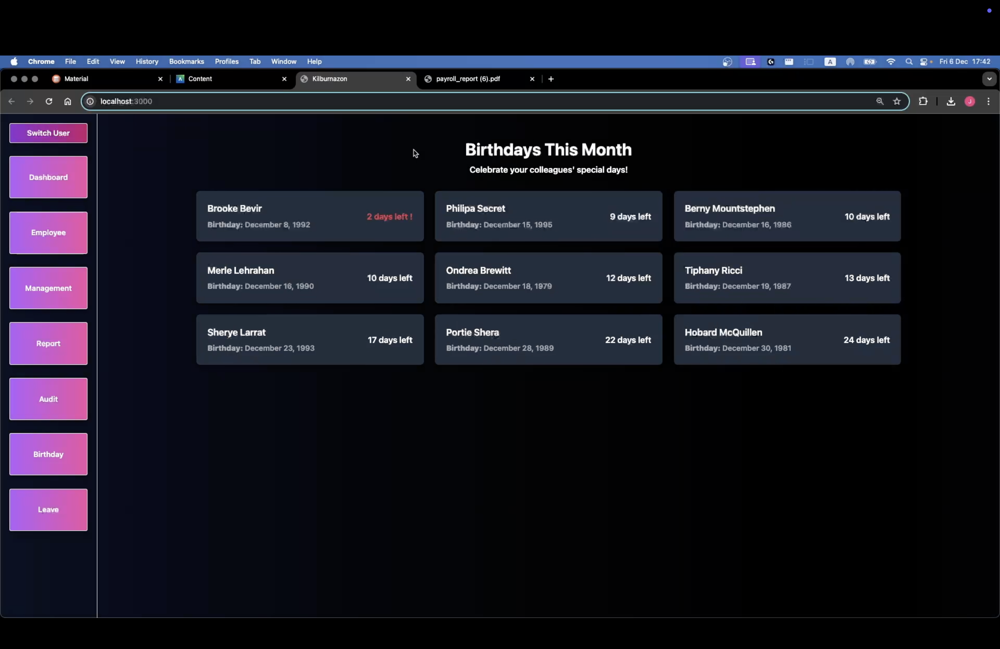

# Project Name

## Overview
This project is a web application that manages employee data, including payroll, leave requests, promotions, and audit logs. It consists of a frontend built with React and Tailwind CSS, and a backend built with PHP.

## Project Structure

  
  
  
  
  
  
  
  

## Technologies  
- React
- PHP
- MYSQL
